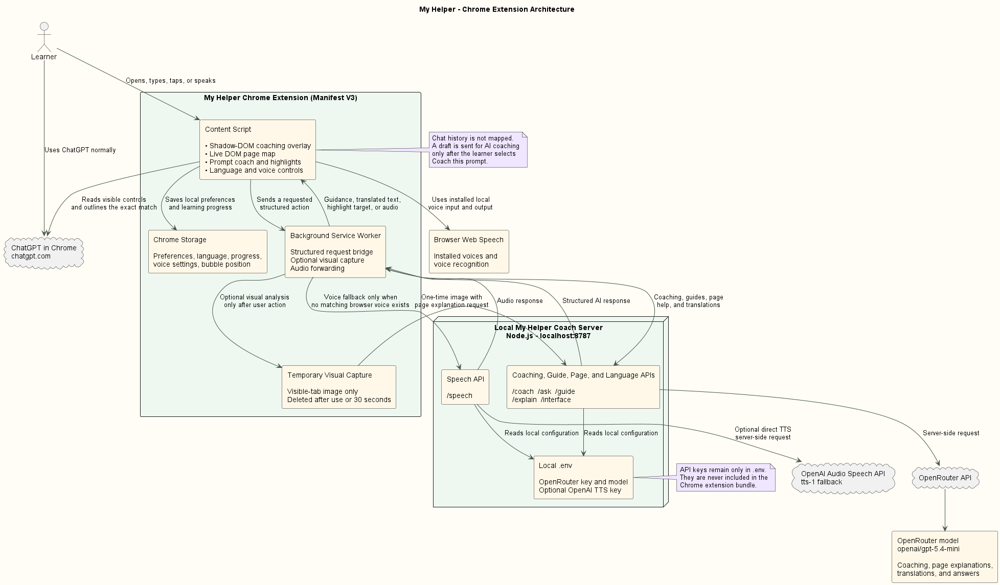

# My Helper

> Your personal AI coach for ChatGPT and Codex.

My Helper is an educational Chrome extension that appears beside ChatGPT and helps people learn how to use ChatGPT and Codex while they work.

It explains visible ChatGPT features in plain language, highlights the real control a user needs, coaches better prompts, offers multilingual text and voice guidance, and helps users learn how to use them over time.

## Why My Helper

Many people have access to ChatGPT and Codex but do not know where to begin.

They may be unsure what to ask, what a feature does, where a setting lives, or how to make a prompt more useful. This can be especially difficult for new users, older adults, and people who prefer simple visual guidance.

## What My Helper Does

### Explains visible features

My Helper reads the current ChatGPT page and its visible controls. It explains features in plain language and shows the user where to click when the user ask it.

### Highlights the correct control

When a user asks where to find something, My Helper maps real visible controls on the current page, scrolls to the correct place, and outlines the matching feature.

### Coaches prompts

My Helper gives encouraging feedback, identifies missing details, suggests a stronger prompt, and provides an AI reviewed prompt score only after the user chooses Coach this prompt.

### Teaches while users work

My Helper provides guided lessons for ChatGPT, Codex, prompting, projects, automation, agents, APIs, and professional AI use.

### Supports languages and voice

My Helper supports multilingual interface text, AI responses, browser voice input, browser installed voices, and optional cloud speech when a suitable local voice is unavailable.

### Supports accessibility

My Helper includes large text, high contrast, keyboard close with Escape, visible captions, voice guidance, and a movable assistant bubble.

## How It Works

```text
User on ChatGPT
  ↓
My Helper reads the current route and visible controls
  ↓
The user chooses a coaching or guidance action
  ↓
The local coach server sends the requested information to OpenRouter
  ↓
My Helper shows an explanation, coaching response, or highlighted control
```

## Architecture



The architecture diagram contains component names and data flow only. It contains no API keys, user data, prompts, screenshots, or private configuration values.

## Key Technical Decisions

### Separate coaching overlay

My Helper never sends a message into the user’s ChatGPT conversation and never presses ChatGPT Send.

### Live DOM mapping

My Helper maps live visible page controls instead of relying on fixed screen coordinates. This allows it to highlight the real feature currently shown on the page.

### Optional visual analysis

Visual analysis is optional. When enabled, My Helper can use a temporary image of the visible browser tab to understand the page layout. The final highlight is still attached to a real live page control.

### User controlled sharing

A prompt is sent for AI coaching only after the user selects Coach this prompt. Page guidance uses the current route and visible controls rather than automatically reading chat history.

### Protected API keys

API keys remain in the local `.env` file and are used only by the local coach server. They are not included in browser extension code.

## Requirements

1. Google Chrome desktop

2. Node.js 18 or newer

3. An OpenRouter API key

4. Optional OpenAI Platform API key for cloud speech fallback

## Configure My Helper

Create or update the `.env` file in the My Helper folder.

```env
OPENROUTER_API_KEY=your_openrouter_key_here
OPENROUTER_MODEL=openai/gpt-5.4-mini
OPENAI_API_KEY=your_openai_platform_key_here
OPENAI_TTS_MODEL=tts-1
OPENAI_TTS_VOICE=nova
PORT=8787
```

`OPENAI_API_KEY`, `OPENAI_TTS_MODEL`, and `OPENAI_TTS_VOICE` are optional. My Helper uses installed browser voices first. Cloud speech is used only when a suitable local voice is unavailable.

Never commit or share your `.env` file.

## Run Locally

1. Open a terminal in the My Helper folder.

2. Start the coach server.

```powershell
npm start
```

3. Open Chrome and visit:

```text
chrome://extensions
```

4. Enable Developer mode.

5. Select Load unpacked.

6. Select the My Helper folder that contains `manifest.json`.

7. Open or refresh:

```text
https://chatgpt.com
```

8. Select the Need help? bubble.

After changing `content.js`, `background.js`, or `manifest.json`, reload My Helper from `chrome://extensions` and refresh ChatGPT.

After changing `.env` or `server.mjs`, stop the server and run `npm start` again.

## Test My Helper

1. Open ChatGPT and select Need help?

2. Select Improve prompt.

3. Enter a real request such as:

```text
Help me plan a study schedule for my exams.
```

4. Select Coach this prompt.

5. Return home and select Explain this page.

6. Select one of the Show buttons and confirm that My Helper outlines the matching visible ChatGPT control.

7. Open Settings and change the text language.

8. Choose an available local voice and select Test voice.

9. Enable visual analysis only if you want My Helper to use a temporary image of the visible browser tab.

10. Move the My Helper bubble, refresh ChatGPT, and confirm that it returns to the saved position.

## Privacy

Read the full [Privacy Policy](PRIVACY.md).

My Helper does not automatically send ChatGPT messages, press Send, upload files, or change account settings.

My Helper does not automatically read chat history.

Visual analysis is optional and may capture any content currently visible in the browser tab.

## Security

Read the [Security Policy](SECURITY.md).

Never place API keys in `content.js`, `background.js`, `manifest.json`, screenshots, recordings, or GitHub commits.

## Chrome Web Store

Extension link: Coming soon.

After publication, replace this text with your public Chrome Web Store link.

## Development With Codex and GPT 5.6

My Helper was developed with Codex and GPT 5.6 as the primary development partner.

Codex helped plan the Manifest V3 extension and local Node.js coach server architecture.

Codex helped build the overlay, prompt coach, guided learning views, settings, progress tracking, language support, voice features, and accessibility features.

Codex helped implement live visible control mapping, accurate page highlights, optional visual analysis, Chrome storage, the background service worker, and the local coach server.

Codex also helped diagnose layout, language, voice, highlight, and browser extension issues through repeated testing feedback.

## Runtime Model Disclosure

The live coaching model in this repository is OpenRouter `openai/gpt-5.4-mini`.

GPT 5.6 was used in Codex to build and refine My Helper. GPT 5.4 mini is the runtime model selected through OpenRouter to manage testing cost.

## Current Limitations

My Helper currently uses a local coach server, so the server must be running for AI coaching, explanations, translations, and cloud speech fallback.

Browser voice availability depends on the user’s operating system and installed voices.

The extension works on Chrome desktop with ChatGPT. It cannot overlay the separate native Codex desktop application.

Chrome requires a user action before an extension can capture a visible tab image.

## License

[Apache License 2.0](LICENSE)
